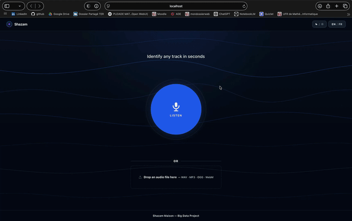

# Shazam

<div align="right">
  
  &nbsp;
  <a href="./README.fr.md"></a>
</div>


A music recognition system inspired by Shazam, developed as part of a Big Data project (Master IAD, S2). Given an audio clip captured from a microphone or uploaded as a file, the system identifies the matching track from a database of several hundred titles and displays streaming links.

The approach combines the power of deep learning embeddings (FAISS vector search) with spectral fingerprinting inspired by the original Shazam patent, forming a hybrid two-stage pipeline that remains robust against noise, reverberation, and short audio clips.

---

## Table of Contents

- [Video Presentation](#video-presentation)
- [How It Works](#how-it-works)
  - [Fingerprinting in Detail](#fingerprinting-in-detail)
- [Project Architecture](#project-architecture)
- [Embedding Methods](#embedding-methods)
- [Requirements](#requirements)
- [Installation](#installation)
- [Tests](#tests)
- [Data](#data)
- [Quick Start](#quick-start)
- [Essential Commands](#essential-commands)
- [Configuration](#configuration)
- [Web Interface](#web-interface)
- [RIR Augmentation](#rir-augmentation)
- [Evaluation](#evaluation)
- [Data Storage](#data-storage)
- [Important Notes](#important-notes)
- [Technologies](#technologies)
- [Future Improvements](#future-improvements)
- [Project Report](#project-report)
- [References](#references)
- [Author](#author)

---

## Video Presentation

<div align="center">
  <a href="https://youtu.be/hohbve2WNwU?si=Qv1Tyfz8-z5lxg5e"></a>
</div>

---

## How It Works

The identification pipeline runs in two successive stages.

```
Query audio
      │
      ▼
┌─────────────────────────────────────────┐
│  Stage 1 — Vector Search                │
│                                         │
│  Split into 5s windows                  │
│  → Embedding (MFCC / CLAP / MuQ / MERT) │
│  → FAISS search (cosine)                │
│  → Top candidate tracks                 │
└────────────────┬────────────────────────┘
                 │
                 ▼
┌─────────────────────────────────────────┐
│  Stage 2 — Shazam Fingerprinting        │
│                                         │
│  Spectral constellation of the query    │
│  ↔ SQLite fingerprints of candidates    │
│  → Temporal alignment (histogram)       │
│  → Temporal coherence score             │
└────────────────┬────────────────────────┘
                 │
                 ▼
      Final ranking
      (FP score first, FAISS as tiebreaker)
```

**Stage 1** transforms each 5-second window into an embedding vector via a pre-trained model, then queries the FAISS index to find the nearest segments in vector space. Results are aggregated by track to produce the `VECTOR_TOP_N_TRACKS` (default: 50) best candidates.

**Stage 2** applies Shazam fingerprinting: extraction of a constellation of spectral peaks, comparison with fingerprints stored in SQLite, and temporal alignment via an offset histogram. This score is more discriminative than cosine similarity and more robust to audio degradation.

The **final score** sorts first by fingerprint score (ground truth), then by FAISS score as a tiebreaker. If fingerprinting fails for all candidates (heavily degraded audio), the ranking falls back to FAISS scores alone.

### Fingerprinting in Detail

The fingerprinting is an implementation of the original Shazam patent (Wang, 2003). It operates in three steps:

```
Audio signal (22 050 Hz)
        │
        ▼
┌───────────────────────────────┐
│  Spectrogram (STFT)           │
│                               │
│  Frequency                    │
│    ^   *       *              │
│    │      *  *    *    *      │  ← spectral peaks
│    │   *           *          │    (constellation map)
│    └──────────────────> Time  │
└──────────────┬────────────────┘
               │  local peak detection
               ▼
┌───────────────────────────────┐
│  Hash generation              │
│                               │
│  Anchor (f1, t1)              │
│      └─── target (f2, t2)     │
│                               │
│  hash = (f1, f2, Δt, t1)      │  ← 4-tuple per pair
└──────────────┬────────────────┘
               │
               ▼
┌───────────────────────────────┐
│  Temporal alignment           │
│                               │
│  For each shared hash         │
│  between query and candidate: │
│  offset = t1_base − t1_query  │
│                               │
│  Offset histogram →           │
│  peak = temporal coherence    │
└───────────────────────────────┘
```

Each hash encodes a peak pair `(anchor_freq, target_freq, delta_time)` along with the anchor's temporal position `t1`. A 3-minute track typically generates several thousand hashes, stored in SQLite as pickled BLOBs.

Temporal alignment is the key to robustness: two different tracks may share a few hashes by chance, but only the correct track will show a clear peak in the offset histogram — all its matching hashes align at the same temporal offset.

---

## Project Architecture

```
Project/
├── manage.py                        # Single entry point — all commands
├── src/
│   ├── config.py                    # Centralized parameters (READ FIRST)
│   ├── ingestion/
│   │   ├── ingest.py                # Download → embeddings → index pipeline
│   │   ├── augment_rir.py           # Room Impulse Response augmentation
│   │   └── fingerprints.py          # Fingerprint rebuilding
│   ├── features/
│   │   └── embeddings_audio.py      # MFCC / CLAP / MuQ / MERT extraction
│   ├── index/
│   │   └── build_index.py           # FAISS index construction
│   ├── retrieval/
│   │   ├── query_pipeline.py        # Stage 1 + Stage 2 orchestration
│   │   └── searcher.py              # FAISS search + aggregation
│   ├── evaluation/
│   │   ├── evaluate.py              # Top-1 / Top-5 / MRR / latency metrics
│   │   ├── rir_impact.py            # RIR impact analysis on a single file
│   │   └── plots.py                 # PNG chart generation
│   └── maintenance/
│       ├── check.py                 # Data integrity verification
│       ├── enrich.py                # Metadata enrichment (Deezer / MusicBrainz)
│       └── clean.py                 # Clean track deletion
├── webapp/
│   ├── backend/server.py            # FastAPI (3 routes)
│   └── frontend/                    # React 18 + Vite (SPA)
│       └── src/
│           ├── App.jsx              # Global state, view routing
│           └── components/          # ListenButton, DropZone, ResultView…
├── data/                            # Persistent data (git-ignored)
│   ├── chroma/                      # Embedding vectors (ChromaDB)
│   ├── features/fingerprints.db     # Shazam fingerprints (SQLite, WAL mode)
│   ├── index/                       # FAISS index + Parquet segments
│   ├── processed/metadata.parquet   # Enriched track metadata
│   ├── raw/                         # Test audio files
│   └── rir/                         # Room Impulse Response WAV files (optional)
├── results/
│   ├── EXPERIMENTS.md               # Experiment log (versioned)
│   ├── eval/                        # Generated evaluation outputs
│   ├── benchmark/                   # Benchmark snapshots (some files are versioned in this repo)
│   └── plots/                       # Generated PNG charts for the report
└── research_paper/                  # Reference papers (PDF)
```

---

## Embedding Methods

Four methods are available and can coexist in the same database. The active method is defined by `EMBEDDING_METHOD` in `src/config.py`.

| Method | Model | Dim. | Sample Rate | Compatibility | Notes |
|--------|-------|------|-------------|---------------|-------|
| `mfcc` | — (librosa) | 40 | 22 050 Hz | CPU | Fast, no model dependency |
| `clap` | `laion/clap-htsat-unfused` | 512 | 48 000 Hz | CUDA, MPS, CPU | General-purpose, good quality/speed tradeoff |
| `clap` | `laion/larger_clap_music` | 512 | 48 000 Hz | CUDA, MPS, CPU | Music-specialized, higher precision |
| `muq` | `OpenMuQ/MuQ-large-msd-iter` | 1 024 | 24 000 Hz | CUDA only | Best precision, requires NVIDIA GPU |
| `mert` | `m-a-p/MERT-v1-95M` | 768 | 24 000 Hz | CUDA, MPS | Music representation model |

Each track stores already-computed methods in the `embedded_methods` field of `metadata.parquet`. Re-running `ingest` after a method change only computes what is missing — existing tracks are not re-downloaded.

---

## Requirements

- **Python 3.10 (64-bit)** required
- **Tested with Python 3.10.9**
- **Python 3.11+ is not supported** for now: some dependencies break on newer versions
- **Node.js 18+** (for the React frontend)
- **ffmpeg** installed and available in PATH
- **yt-dlp** (installed via `requirements.txt`)
- GPU recommended for CLAP / MuQ / MERT (CPU works for MFCC and CLAP)

---

## Installation

```bash
# 1. Clone the repository
git clone <url>
cd Projet

# 2. Create and activate a Python 3.10 (64-bit) virtual environment
python3.10 -m venv venv
source venv/bin/activate          # macOS / Linux
# py -3.10-64 -m venv venv        # Windows
# venv\Scripts\activate           # Windows

# 3. Install Python dependencies
pip install -r requirements.txt

# 4. Install frontend dependencies
cd webapp/frontend && npm install && cd ../..
```

> For the web interface, install the root `requirements.txt`: the backend imports the full identification pipeline from `src/`, so `webapp/backend/requirements.txt` alone is not sufficient for `/api/identify`.

---

## Tests

The Python/backend test suite is organized under [`tests/`](tests/README.md) and can be run through `manage.py`.

```bash
python manage.py test
python manage.py test --buffer
python manage.py test --unit
python manage.py test --integration --failfast
```

Use [`tests/README.md`](tests/README.md) for the layout, conventions, and current coverage notes.

---

## YouTube Download

Audio downloads are handled by [`src/utils/youtube.py`](src/utils/youtube.py), which is used by ingestion, fingerprint rebuilding, and RIR augmentation.

Default behavior:
- The project prefers `python -m yt_dlp` from the active virtual environment. If that module is not available, it falls back to a `yt-dlp` executable in `PATH`.
- The downloader ignores user/global `yt-dlp` config files so the behavior stays reproducible across machines.
- Browser cookies are not required by default.
- `ffmpeg` is required to extract/convert audio after download.

Recommended setup:
```bash
source venv/bin/activate
pip install -r requirements.txt
ffmpeg -version
python -m yt_dlp --version
```

Optional environment variables:
- `FFMPEG_BINARY=/absolute/path/to/ffmpeg`: use this if `ffmpeg` is installed but not exposed in `PATH`.
- `YT_DLP_BROWSER=firefox`: allow `yt-dlp` to read cookies from a local browser when a video requires authentication.
- `YT_DLP_COOKIEFILE=/path/to/cookies.txt`: use an exported Netscape cookie file instead of browser integration.

Troubleshooting:
- `ffmpeg is not installed or not found`: install `ffmpeg` or set `FFMPEG_BINARY`.
- `yt-dlp is not installed or not found in PATH`: activate the project venv and reinstall `requirements.txt`.
- `video requires authentication/cookies`: retry with `YT_DLP_BROWSER` or `YT_DLP_COOKIEFILE`.
- `video unavailable` or `video unavailable in this region`: this is a YouTube-side limitation, not a project bug.

Notes:
- Downloaded audio is stored in a temporary directory during processing, then removed by the pipeline.
- The code aims to be portable, but no implementation can guarantee every YouTube video on every machine because availability, rate limits, cookies, and regional restrictions are controlled by YouTube.

---

## Data

Music data comes from Spotify charts via Kaggle. The pipeline automatically downloads audio from YouTube into RAM (no MP3 stored on disk) using the artist and track names from the CSV.

**Expected CSV columns:**

| Column | Description |
|--------|-------------|
| `track_name` | Track title |
| `artist_names` | Artist name |

Kaggle `spotify-streaming-top-50-*.csv` files are directly compatible. Place them in `data/kaggle/data/`.

To download the Kaggle CSV files into the project's configured directory (`data/kaggle/data/`), run from the repository root after activating the virtual environment:

```bash
source venv/bin/activate
python manage.py download-kaggle-csvs
```

This command uses the same path as the ingestion code and recreates the expected structure locally:

```text
data/kaggle/data/spotify-streaming-top-50-world.csv
data/kaggle/data/spotify-streaming-top-50-france.csv
data/kaggle/data/spotify-streaming-top-50-usa.csv
```

**Dataset used:** [Spotify Streaming Top 50 — Kaggle](https://www.kaggle.com/datasets/anxods/spotify-top-50-playlist-songs-anxods) — daily Top 50 charts worldwide and by country.

**Automatic deduplication:** a track appearing in multiple CSVs (global hits in the France, US, and World charts) is processed only once, identified by its `track_id` (MD5 hash of `artist_title`).

**Policy for local test queries:** files stored in `data/raw/` (reference excerpts, microphone captures, local `manifest.json`) are intentionally not versioned on GitHub. The repository only keeps the folder structure, a manifest example, and the supporting documentation in [`data/raw/README.md`](./data/raw/README.md). Real audio files should stay on each teammate's machine or be shared through private storage.

---

## Quick Start

```bash
source venv/bin/activate

# One command runs the full pipeline: ingest → augment → enrich
python manage.py build --csv data/kaggle/data/spotify-streaming-top-50-world.csv

# Launch the web interface
python manage.py webapp
# → http://localhost:5173
```

---

## Essential Commands

```bash
# ── Construction ───────────────────────────────────────────────────────────

# Full pipeline in one command: ingest → augment → enrich
python manage.py build --csv data/kaggle/data/spotify-streaming-top-50-world.csv

# Or step by step
python manage.py ingest --csv data/kaggle/data/spotify-streaming-top-50-world.csv
python manage.py augment
python manage.py enrich

# ── Identification ─────────────────────────────────────────────────────────

# Identify a track (simple output)
python manage.py identify data/raw/my_audio.mp3

# With score details and top 10
python manage.py identify data/raw/my_audio.mp3 --top 10 --detailed

# Download a test clip (saved to data/raw/ + registered in manifest)
python manage.py download-test "Daft Punk Get Lucky" --duration 30 --position middle

# ── Web interface ──────────────────────────────────────────────────────────

python manage.py webapp                    # dev  → http://localhost:5173
python manage.py webapp --prod             # prod → http://localhost:8000

# ── Maintenance ────────────────────────────────────────────────────────────

# Check active configuration
python manage.py config

# Check data integrity
python manage.py check
python manage.py check --details           # detailed warnings by category
python manage.py check --purge --yes       # delete corrupted tracks

# Rebuild after a purge
python manage.py rebuild --what index
```

> The exhaustive reference for all commands and options is in **[COMMANDS.md](./COMMANDS.md)**.

---

## Configuration

All parameters are centralized in `src/config.py`. No constant should be duplicated elsewhere.

```python
# ── Active embedding method ────────────────────────────────────────────────
EMBEDDING_METHOD = "clap"       # "mfcc" | "clap" | "muq" | "mert"

# ── Identification pipeline ────────────────────────────────────────────────
VECTOR_TOP_N_TRACKS = 50        # candidate tracks aggregated by Stage 1 and passed to Stage 2
SEGMENT_WIN_S       = 5.0       # audio window duration (seconds)
SEGMENT_HOP_S       = 3.0       # step between windows (seconds)

# ── RIR augmentation ───────────────────────────────────────────────────────
RIR_SOURCE  = "synthetic"       # "synthetic" | "mit"
RIR_N       = 5                 # number of RIRs applied per track
RIR_MIT_DIR = "data/rir"        # MIT WAV directory (if RIR_SOURCE = "mit")

# ── Web interface ──────────────────────────────────────────────────────────
UI_LISTEN_DURATION  = 15        # microphone recording duration (seconds)
UI_CONFIDENCE_RATIO = 2.5       # score[0]/score[1] ratio → "confident" badge

# ── Download ───────────────────────────────────────────────────────────────
DOWNLOAD_WORKERS = 5            # parallel yt-dlp workers
```

---

## Web Interface

The web interface allows track recognition directly from the browser, with no additional client-side installation required.

### API Routes (FastAPI)

| Method | Route | Body / Response |
|--------|-------|-----------------|
| `POST` | `/api/identify` | `multipart/form-data` → JSON (results + recommendations) |
| `GET` | `/api/config` | JSON (`listen_duration`, `embedding_method`, `confidence_ratio`) |
| `GET` | `/api/health` | `{"status": "ok"}` |

### Features

- **Microphone recording** — animated countdown, configurable duration via `UI_LISTEN_DURATION`
- **File upload** — drag-and-drop or file picker (MP3, WAV, OGG, WebM)
- **Result** — album art, title, artist, direct streaming links (YouTube, Spotify, Deezer, Apple Music)
- **Recommendations** — 4 similar tracks with detail modal and links
- **Debug mode** — `</>` button: top 10 candidates with the current final ranking scores
- **Dark / light theme** and **bilingual interface** EN / FR

### Launch Modes

| Mode | Frontend | Backend | Access |
|------|----------|---------|--------|
| Development | Vite hot-reload `:5173` | uvicorn `--reload` `:8000` | http://localhost:5173 |
| Production | Static build in `dist/` | uvicorn `:8000` | http://localhost:8000 |

> In development, the Vite proxy targets `http://localhost:8000` by default. If you change the backend port, update `webapp/frontend/vite.config.js` accordingly.

---

## RIR Augmentation

A Room Impulse Response (RIR) is the acoustic response of a space to an impulse sound — it captures how a room colors audio (reflections, reverberation, absorption). Convolving a track with a RIR produces a version that sounds as if it were recorded in that space.

The principle: for each track in the database, N reverberant versions are generated via FFT convolution (`scipy.signal.fftconvolve`), their embeddings are computed, and they are added to ChromaDB and the FAISS index. When a query arrives from a reverberant environment, it naturally finds its nearest neighbors among these augmented versions.

**The operation is idempotent:** RIRs already applied to a track are recorded in the `rir_augmented` field of `metadata.parquet` and skipped on subsequent calls. Only missing RIRs are computed.

### Synthetic RIR Generation

Each synthetic RIR is built from three components:

1. **Direct sound** — impulse at 1 ms
2. **Early reflections** — 12 to 30 random reflections with exponential decay based on RT60
3. **Diffuse tail** — decaying Gaussian noise after 50 ms, simulating late reverberation

The 10 predefined environments cover a wide RT60 range:

| Environment | RT60 |
|-------------|------|
| `bathroom` | 0.15 s |
| `small_room` | 0.25 s |
| `bedroom` | 0.35 s |
| `office` | 0.40 s |
| `corridor` | 0.55 s |
| `living_room` | 0.60 s |
| `classroom` | 0.80 s |
| `warehouse` | 0.90 s |
| `large_hall` | 1.20 s |
| `concert_hall` | 1.60 s |

### Available Sources

| Source | Description | Advantages |
|--------|-------------|------------|
| `synthetic` | Generated mathematical RIRs (10 environments, RT60: 0.15 s – 1.60 s) | No download required, reproducible, fast |
| `mit` | Real RIRs measured in actual spaces (MIT Acoustical Survey) | More realistic, requires WAV files in `data/rir/` |

With `source = "mit"`, the system loads all available WAV files, estimates each one's RT60 via Schroeder integration (energy decay of −60 dB from peak), then selects the N most diverse ones by uniform sampling over the sorted RT60 curve — guaranteeing maximum coverage of the acoustic range.

---

## Evaluation

The project includes a comprehensive evaluation suite to measure and compare pipeline performance.

### Metrics

| Metric | Description |
|--------|-------------|
| **Top-1** | Correct track is in the first position |
| **Top-5** | Correct track is within the top 5 results |
| **Top-10** | Correct track is within the top 10 results |
| **Mean Stage 1 rank** | Average FAISS-only ranking position |
| **Mean final rank** | Average ranking position after fingerprint reranking |

### Evaluation Workflow

```bash
# 1. Build the test manifest with your real queries
#    (reference excerpts in data/raw/reference_clips/
#     and microphone recordings in data/raw/mic_recordings/)

# 2. Base report-oriented evaluation on the manifest
python manage.py eval

# 3. Same base suite, explicit alias
python manage.py eval base

# 4. Focused analyses
python manage.py eval studio-mic
python manage.py eval duration
python manage.py eval stage12
python manage.py eval mic-conditions

# 5. RIR impact analysis on the same manifest queries
python manage.py eval rir
```

### Main Evaluation Outputs

| File | Chart | Source |
|------|-------|--------|
| `results/plots/pipeline_resilience_overview.png` | Main base-suite overview plot (Stage 1 vs Stage 2 on real manifest queries) | `eval`, `eval base` |
| `results/eval/eval_topk_summary_by_category.csv` | Top-k summary by category (`Overall`, `Query type`, `Duration`, `Microphone condition`, `Scenario`) | `eval`, `eval base` |
| `results/eval/base_eval_rows.json` | Shared base evaluation rows reused by all base analyses | `eval`, `eval base` |
| `results/eval/studio_mic.json` | Studio vs microphone analysis | `eval`, `eval studio-mic` |
| `results/eval/duration.json` | Duration analysis (`5s`, `15s`, `30s`) | `eval`, `eval duration` |
| `results/eval/stage12.json` | Stage 1 vs Stage 2 ranking analysis | `eval`, `eval stage12` |
| `results/eval/mic_conditions.json` | Microphone distance / speech analysis | `eval`, `eval mic-conditions` |
| `results/plots/rir_pipeline_overview.png` | Overview plot: without RIR vs with RIR on the same manifest queries | `eval rir` |
| `results/eval/rir_topk_summary_by_category.csv` | Top-k summary by category, before vs after RIR | `eval rir` |
| `results/eval/rir_topk_summary_by_condition.csv` | Per-condition RIR summary derived from the manifest queries | `eval rir` |

---

## Data Storage

### ChromaDB — `data/chroma/`

Embedding vector database. One collection per method (e.g. `clap_clap_htsat_unfused`). Each document corresponds to a 5-second audio segment, identified by `{track_id}_{segment_index}`, annotated with `track_id` and `start_s`.

### SQLite — `data/features/fingerprints.db`

Shazam spectral fingerprints. One row per track (`INSERT OR REPLACE`, idempotent). WAL mode enabled for concurrent access resistance. Each entry contains spectral constellation hashes serialized as a pickled BLOB.

### FAISS — `data/index/`

Vector search index per method and type:
- `index_{method}_{type}.faiss` — indexed vectors
- `segments_{method}.parquet` — FAISS position → (`track_id`, `start_s`) mapping

Three index types are available, configurable via `INDEX_TYPE` in `src/config.py`:

| Type | Algorithm | Precision | Speed | Parameters |
|------|-----------|-----------|-------|------------|
| `flat` | Bruteforce — exact inner product (`IndexFlatIP`) | Exact | Slow | None |
| `hnsw` | Hierarchical Navigable Small World (`IndexHNSWFlat`) | ~99% | Fast | M=32, efConstruction=40 |
| `ivf` | Inverted file lists (`IndexIVFFlat`) | Approximate | Fast | nlist=√N |

`flat` is recommended for databases under 100,000 vectors — the project size does not justify approximation. `hnsw` becomes relevant beyond that. The similarity metric used is **inner product**, embeddings being normalized upstream.

### Parquet — `data/processed/metadata.parquet`

Central track table. Main columns:

| Column | Description |
|--------|-------------|
| `track_id` | MD5 hash of `artist_title` |
| `title`, `artist` | Track identity |
| `album`, `genre`, `release_date` | Enriched metadata |
| `cover_url` | Album art URL |
| `embedded_methods` | List of computed methods |
| `rir_augmented` | Dict `{collection: [rir_names]}` |

Atomic writes (temp file + rename) to survive crashes during ingestion.

---

## Important Notes

**Automatic crash recovery** — `ingest` saves after each track. A sudden interruption loses at most the track in progress. Rerunning the same command resumes exactly where it left off via the `embedded_methods` field.

**Audio in RAM** — audio downloaded via `ingest` is never written to disk. It flows directly into memory via ffmpeg pipe → librosa. Only embeddings, fingerprints, and indexes are persisted.

**Multi-method** — multiple methods can coexist in the database. Change `EMBEDDING_METHOD` in `config.py` and rerun `ingest`: tracks already processed for this method are skipped, others are completed.

**MuQ on Apple Silicon** — MuQ does not support Float16 on CPU or MPS (ComplexFloat operations not supported). It runs exclusively on CUDA. On Mac without an NVIDIA GPU, use `clap` or `mfcc`.

**SQLite and concurrent access** — if the project resides in an iCloud-synced folder, background uploads can lock `fingerprints.db` and cause `database is locked` errors. The `data/` directory is excluded from iCloud via `xattr`. WAL mode and a retry mechanism are enabled to handle residual contention.

**After `check --purge`** — the FAISS index is removed during the purge. Running `python manage.py rebuild --what index` is mandatory before any identification.

**Microphone recordings stay out of Git** — team-made recordings used for local testing are intentionally excluded from the repository. The professional approach is to version the protocol, the `data/raw/` structure, and a `manifest.example.json`, while keeping the actual audio files in private storage.

---

## Technologies

| Layer | Tools and models |
|-------|-----------------|
| **Audio embeddings** | `laion/clap-htsat-unfused`, `laion/larger_clap_music`, `OpenMuQ/MuQ-large-msd-iter`, `m-a-p/MERT-v1-95M`, librosa (MFCC) |
| **Vector search** | FAISS (Flat / HNSW / IVF), ChromaDB |
| **Fingerprinting** | Shazam spectral constellation — librosa, scipy (FFT, correlation) |
| **Deep learning** | PyTorch (CUDA / MPS / CPU), Transformers (HuggingFace) |
| **Audio** | librosa, soundfile, torchaudio, yt-dlp, ffmpeg |
| **Backend** | FastAPI, uvicorn, pandas, SQLite (WAL), Apache Parquet |
| **Frontend** | React 18, Vite, JavaScript ES6+ |
| **Evaluation** | matplotlib, numpy, scipy |

---

## Future Improvements

The following directions were identified but not implemented within the scope of this project.

**Identification pipeline**
- Cross-normalization of FAISS and fingerprint scores to make relative weight independent of database size
- Adaptive segment windowing: shorter windows for tracks with high temporal variation, longer for stable ones
- In-memory FAISS index caching to eliminate load time across successive identifications
- Real-time audio streaming support (WebSocket) rather than fixed-duration recording

**Embeddings**
- Fine-tuning CLAP or MuQ on a corpus of degraded tracks (noise, reverb) to improve robustness in challenging conditions
- Late fusion of multiple embedding methods (score ensemble) to combine their respective strengths
- Vector quantization (PQ — Product Quantization) to reduce the FAISS index memory footprint

**Augmentation**
- Additional degradation conditions during augmentation: MP3 compression artifacts, tempo variations, pitch shifts
- Use of real ambient noise recordings (cafés, public transport) instead of Gaussian white noise

**Infrastructure**
- Replace ChromaDB with a dedicated vector server (Qdrant, Weaviate, Milvus) to scale to millions of tracks
- Incremental FAISS indexing without full reconstruction after each ingestion
- REST ingestion API to populate the database without direct server access

**Web interface**
- Client-side identification history (localStorage)
- Result sharing via short link
- Synchronized lyrics display (via external API)

---

## Project Report

For a full presentation of the approach, technical decisions, and results, see the [project report](./project_report.pdf).

---

## References

Reference papers that guided technical decisions are available in the `research_paper/` folder.

| Author(s) | Title | Relevance |
|-----------|-------|-----------|
| Wang, A. (2003) | *An Industrial Strength Audio Search Algorithm* | Foundation of Shazam fingerprinting — spectral constellation and temporal alignment via offset histogram |
| Wu et al. (2023) | *Large-Scale Contrastive Language-Audio Pretraining* (CLAP) | Multimodal audio-text embedding model used in Stage 1 |
| Zhu et al. (2024) | *MuQ: Self-Supervised Music Representation* | Self-supervised music representation model, best precision on musical corpus |
| Castellon et al. | *Music2Latent2: Audio Embedding via Diffusion* | Alternative embedding approach via latent diffusion model |
| Défossez et al. | *A Fast Audio Similarity Retrieval Method* | Large-scale audio similarity retrieval approach |
| Microsoft Research | *Audio Search and Retrieval* | Industrial techniques for large-scale audio search |
| — | *Fast Music Identification* | Comparison of fingerprinting approaches for rapid identification |
| — | *Audio Fingerprinting* | Survey of spectral fingerprinting methods |
| — | *Predicting Song Title from Audio* | Music recognition approaches via supervised learning |

---

## Author

[Thomas Gourmelen](https://github.com/thmsgo18)

Occasional participation:
[Clara Ait Mokhtar](https://github.com/claraait123), [Maria Aydin](https://github.com/Mmajora53), [Vincent Tan](https://github.com/20centan)
